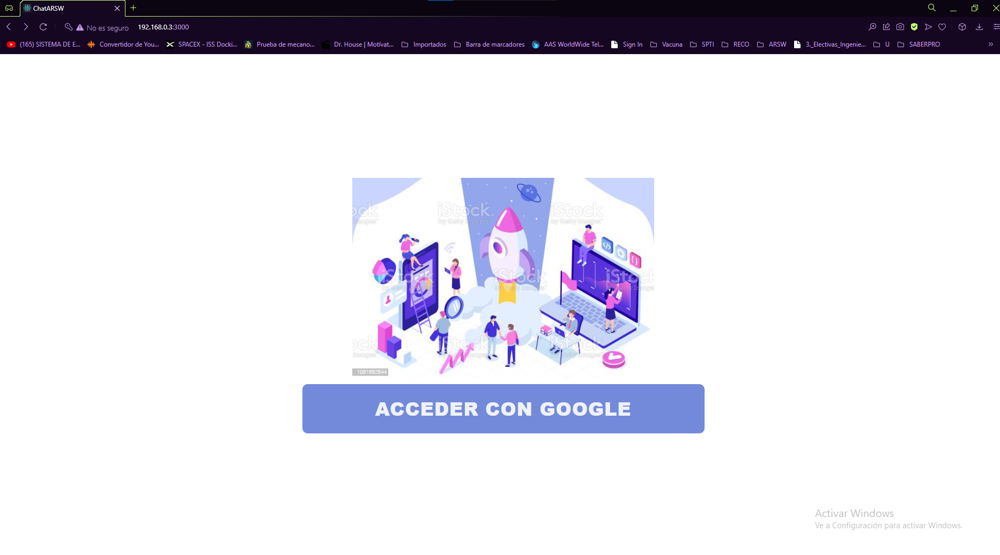
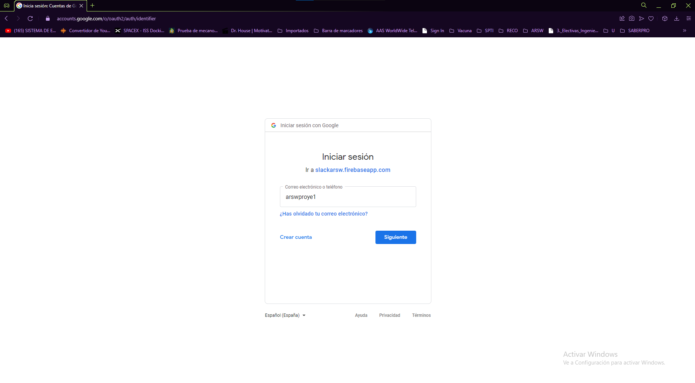
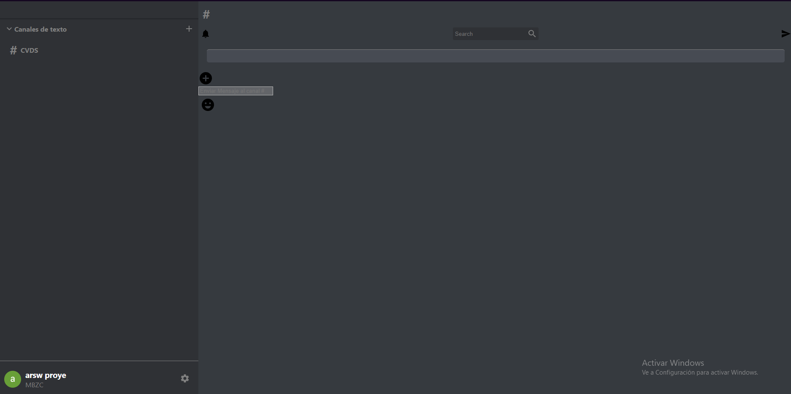
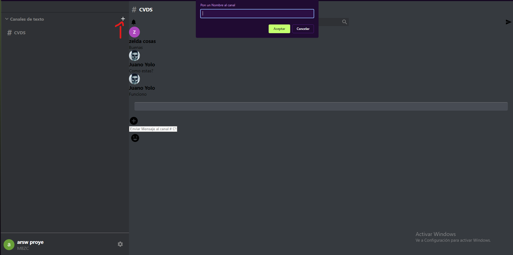
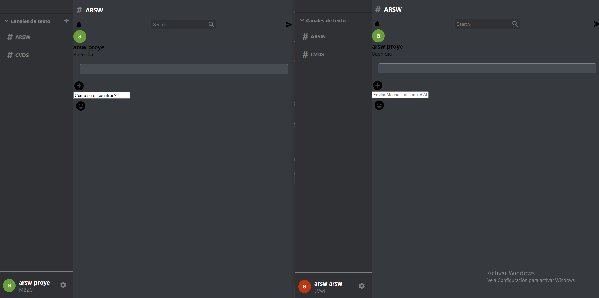
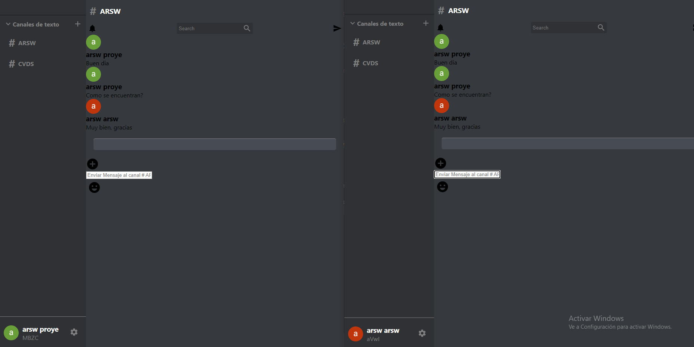

# Proyecto ARSW

## Escuela Colombiana de Ingeniería Julio Garavito

### Autor

- Juan Felipe Monroy Sierra (Equipo de Desarrollo)

## Proyecto final de ARSW (Arquitecturas de Software). Periodo 2022-i

### Docente 

- Luis Daniel Benavides Navarro (Dueño de Producto)

## Pagina en Heroku

### Descripción del producto
#### Descripción general

El sistema permite a los estudiantes comunicarse a traves de un chat institucional
que contara con canales de comunicación para cada materia, donde cada estudiante
podra proponer preguntas, y entre todos se podra generar una comunidad que en tiempo real
podran manifestar sus dudas y hablar de temas correspondientes a la materia.
Se enfoca en crear canales de algunas materias y canales dentro de las materias

### Antecedentes

#### Slack

Es una herramienta que provee un chat, en el cual se pueden crear canales de comunicación,
su uso suele ser para la administración de proyectos entre varias personas

### Manual para el usuario
Al ingresar a [ChatARSW](https://slackarsw.herokuapp.com/)

#### Autenticación

Primero pedira acceder a google como metodo de autenticación para lograr ingresar a la app.

El usuario debera ingresar un correo y una contraseña para poder acceder a la aplicación

#### Chat

Cuando se realize la autenticación satisfactoriamente, se podra entrar a la app, esta es
la pantalla principal de la aplicación.

Dentro de la aplicación existen dos funcionalidades importantes, crear canal y enviar mensajes, para poder 
enviar un mensaje primero tiene que existir un canal creado, lo cual se puede realizar con el simbolo de +
que se encuentra en la parte superior izquierda, donde dice canales de texto.

Así se pueden crear los canales, el usuario puede ponerle el nombre que desee

Luego de esto, el canal creado aparecera en la parte izquierda, el usuario podrá dar click
y acceder al chat de este canal, donde al escribir en el campo de texto y darle enter, podrá
enviar mensajes al canal, los cuales podrán ver los demas usuarios conectados al canal, o los
que ingresen despues.

#### Chat MultiUsuario

Aqui podemos ver una interacción entre dos usuarios.

